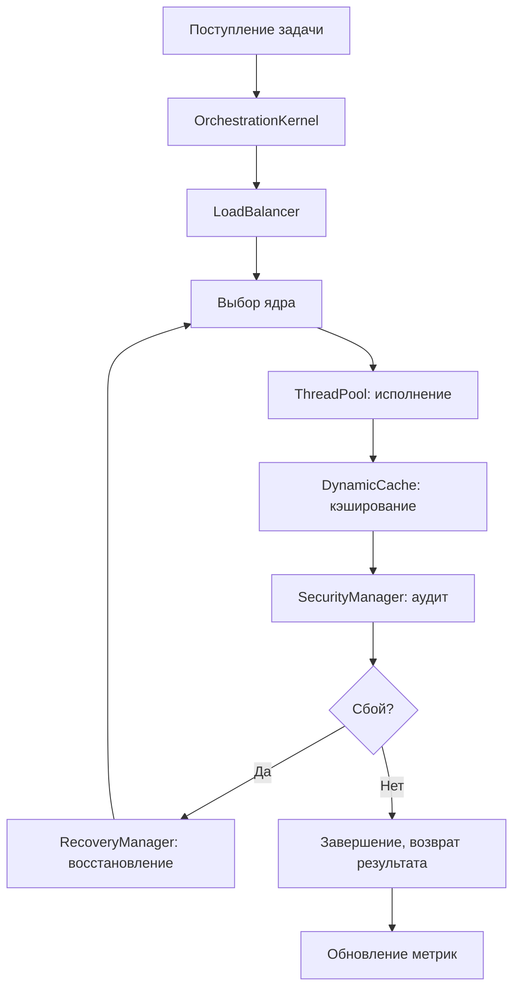

# 🔄 Процессы и потоки Cloud IaaS Service

## 🌀 Жизненный цикл задачи

---

## 📋 Ключевые этапы

- **Поступление задачи** → OrchestrationKernel ставит в очередь
- **Балансировка** → LoadBalancer выбирает ядро по метрикам
- **Выполнение** → ThreadPool, кэширование, аудит
- **Восстановление** → RecoveryManager при сбое
- **Завершение** → результат возвращается, метрики обновляются

---

## 🤝 Взаимодействие компонентов

> Ядра используют LoadBalancer для распределения задач, DynamicCache и CacheManager для кэширования, RecoveryManager для отказоустойчивости, SecurityManager для аудита, ThreadPool для асинхронности.

---

## 🧑‍💻 Пример сценария

> **Сценарий:** Пакетная обработка изображений с криптографией и кэшированием при высокой нагрузке (1000+ задач).
>
> - Задачи поступают в OrchestrationKernel
> - LoadBalancer равномерно распределяет по ядрам
> - Криптография делегируется CryptoKernel (ARM-ускорение)
> - Результаты кэшируются, аудит ведётся SecurityManager
> - RecoveryManager обеспечивает восстановление при сбое

---

[⬅️ К компонентам](./KERNELS_AND_COMPONENTS.md) | [Безопасность](./SECURITY_DESIGN.md) 