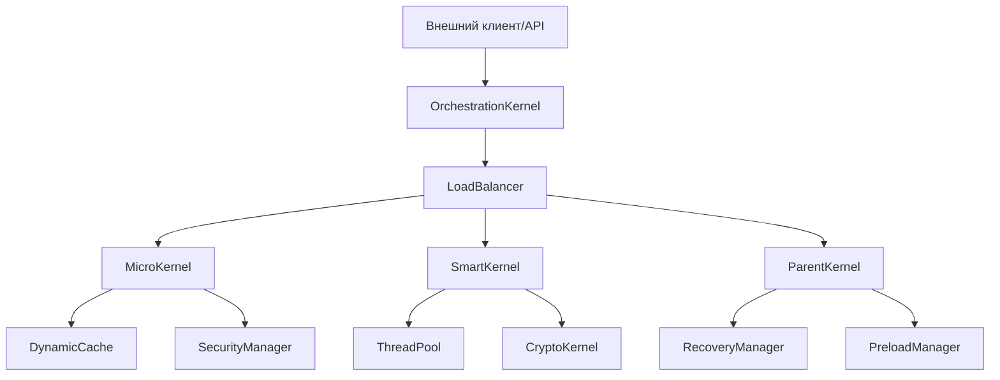

# 🌐 Cloud IaaS Service — Обзор

> **Модульная C++20-платформа для облачных вычислений, балансировки, кэширования, восстановления и безопасности.**

---

## 🏗️ Архитектура (Mermaid)

---

## 📦 Модули

| Модуль         | Описание                                   | Ключевые фичи           |
|----------------|--------------------------------------------|-------------------------|
| `balancer`     | Балансировка нагрузки                      | Гибридные стратегии     |
| `cache`        | Кэширование, динамика, предзагрузка        | LRU, TTL, Preload       |
| `drivers`      | Аппаратные драйверы (ARM/Apple)            | NEON/AMX, оптимизация   |
| `kernel`       | Ядра вычислений, иерархия                  | Расширяемость, PIMPL    |
| `recovery`     | Контрольные точки, восстановление          | Async, retention, метрики|
| `security`     | Безопасность, аудит, криптография          | Политики, OpenSSL, ARM  |
| `thread`       | Пул потоков, метрики, оптимизация          | Адаптация, логирование  |
| `utils`        | Вспомогательные утилиты                    |                         |

---

## 💡 Принципы дизайна

> - Минимализм, модульность, расширяемость
> - Thread Safety, RAII, PIMPL, DI
> - Метрики, аудит, тестируемость

---

## 🛠️ Технологии

- **C++20**, CMake, spdlog, OpenSSL, Boost, nlohmann/json, zlib
- Поддержка: macOS ARM, Linux x64

---

## ⚙️ Как это работает

- Задачи поступают в OrchestrationKernel → LoadBalancer выбирает ядро → задача исполняется в пуле потоков с кэшированием и аудитом.
- RecoveryManager обеспечивает отказоустойчивость, SecurityManager — безопасность.
- Все компоненты интегрированы через современные паттерны и метрики.

---

[⬅️ Назад к README](./README.md) | [Ядра и компоненты](./KERNELS_AND_COMPONENTS.md) 